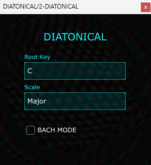

# DIATONICAL | Diatonic Chord Engine

<p align="center">
  <br>
  
</p>

**DIATONICAL** DIATONICAL operates on the principles of **Modulo-12 Arithmetic** and **Set Theory**.
Diatonical generates a triad by applying a **Skip-1 Permutation** across the subset. This is a practical(ish) application of Combinatorial Harmony, where we restrict the total possible note combinations () to essentially just those that satisfy specific interval vectors of Major or Minor scales.


## Refrence
I was inspired by harmonic 'tucking' please see the brilliant paper: [D Conklin, Chord sequence generation with semiotic patterns](https://www.ehu.eus/cs-ikerbasque/conklin/papers/conklinjmm16.pdf).


* **Language:** C++20 / JUCE 7
* **Build System:** CMake
* **Platform:** Optimized for Windows (VST3)
* **Logic:** Non-destructive MIDI processing. The engine clears the audio buffer to minimize CPU overhead while prioritizing high-resolution MIDI timestamping.

## Build (Windows)
Ensure you have **CMake** and **Visual Studio 2022** installed.
Clone the JUCE library to your machine.
Run the following in your terminal:
```bash
mkdir build && cd build
cmake ..
cmake --build . --config Release
```
Copy the resulting `DIATONICAL.vst3` into your DAW's VST3 folder.

